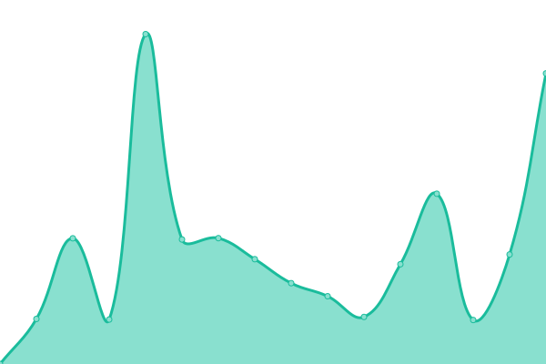
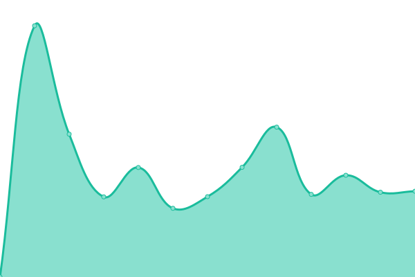
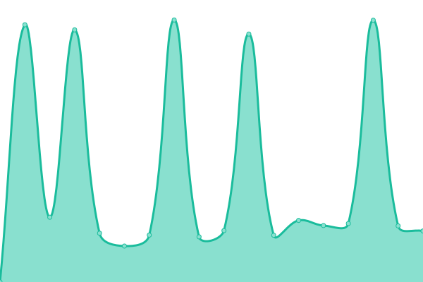

# [📈 Live Status](https://status.ewizz.ninja): <!--live status--> **🟧 Partial outage**

This repository contains the open-source uptime monitor and status page for [EWIZZ](https://status.ewizz.ninja), powered by [Upptime](https://github.com/upptime/upptime).

With [Upptime](https://upptime.js.org), you can get your own unlimited and free uptime monitor and status page, powered entirely by a GitHub repository. We use [Issues](https://github.com/EWIZZDEV/ewizz_status/issues) as incident reports, [Actions](https://github.com/EWIZZDEV/ewizz_status/actions) as uptime monitors, and [Pages](https://status.ewizz.ninja) for the status page.

<!--start: status pages-->
<!-- This summary is generated by Upptime (https://github.com/upptime/upptime) -->
<!-- Do not edit this manually, your changes will be overwritten -->
<!-- prettier-ignore -->
| URL | Status | History | Response Time | Uptime |
| --- | ------ | ------- | ------------- | ------ |
|  [EWIZZ public page](https://www.ewizz.co.za) | 🟥 Down | [ewizz-public-page.yml](https://github.com/EWIZZDEV/ewizz_status/commits/HEAD/history/ewizz-public-page.yml) | 

 4292ms
     
 | 

<a href="https://status.ewizz.ninja/history/ewizz-public-page">100.00%</a>
    

|  [EWIZZ customer portal](https://office.ewizz.co.za) | 🟩 Up | [ewizz-customer-portal.yml](https://github.com/EWIZZDEV/ewizz_status/commits/HEAD/history/ewizz-customer-portal.yml) | 

 1015ms
     
 | 

<a href="https://status.ewizz.ninja/history/ewizz-customer-portal">57.00%</a>
    

|  [EWIZZ API](https://api.ewizz.co.za/v2/user_code?ezcode=abcdef) | 🟩 Up | [ewizz-api.yml](https://github.com/EWIZZDEV/ewizz_status/commits/HEAD/history/ewizz-api.yml) | 

 1118ms
     
 | 

<a href="https://status.ewizz.ninja/history/ewizz-api">98.92%</a>
    

<!--end: status pages-->

[**Visit our status website →**](https://status.ewizz.ninja)

## 📄 License

- Powered by: [Upptime](https://github.com/upptime/upptime)
- Code: [MIT](./LICENSE) © [EWIZZ](https://status.ewizz.ninja)
- Data in the `./history` directory: [Open Database License](https://opendatacommons.org/licenses/odbl/1-0/)
